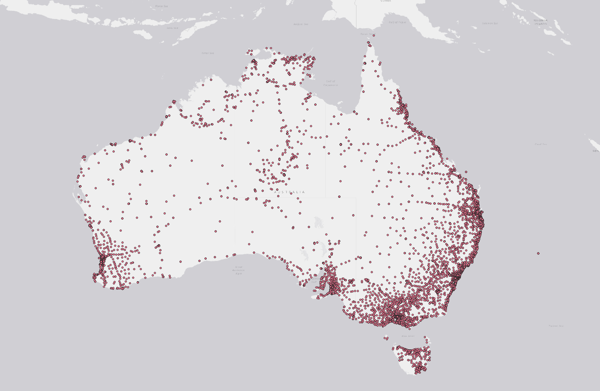

# Australian Payphones


Gets Australian payphone data from Telstra in GeoJSON format.

```shell
$ npm install -g aus-payphones
$ aus-payphones
```

### Program usage

By default, `aus-payphones` will fetch data and place it into the working directory. The file contains the current timestamp. The program offers options to generate a file that contains a date rather than a timestamp and also emit the file to a selected path. 

The following is from the program usage output:

```shell
$ aus-payphones -h
Usage:  aus-payphones [options]

Options:
  --version       Show version number                                  [boolean]
  -f, --filename  The name of the file to emit the features to. The default file
                  takes for form payphones-{timestamp}.json
                              [string] [default: "payphones-1592185512735.json"]
  -d, --datefile  Generate file with date - payphones-{yyyy}-{mm}-{dd}.json
                                                      [boolean] [default: false]
  -p, --path      Path to generate the file. Defaults to current directory
      [string] [default: "/Users/jim.vrckovski/jv/gitrepos/australianpayphones"]
  -t, --test      Sets the mode to test to only download a subset of the data
                                                      [boolean] [default: false]
  -e, --envelope  Sets the envelope for data retrieval
                  [string] [default: "112.91944420700005,-54.75042083099999,159.10645592500006,-9.240166924999869"]
  -h, --help      Show help                                            [boolean]
```

### Sample data

A sample of the data can be found [here](https://github.com/jvrck/australianpayphones/blob/develop/sample-file/2020-06-15.json)

### [Development Information](./documentation/README.md)

 